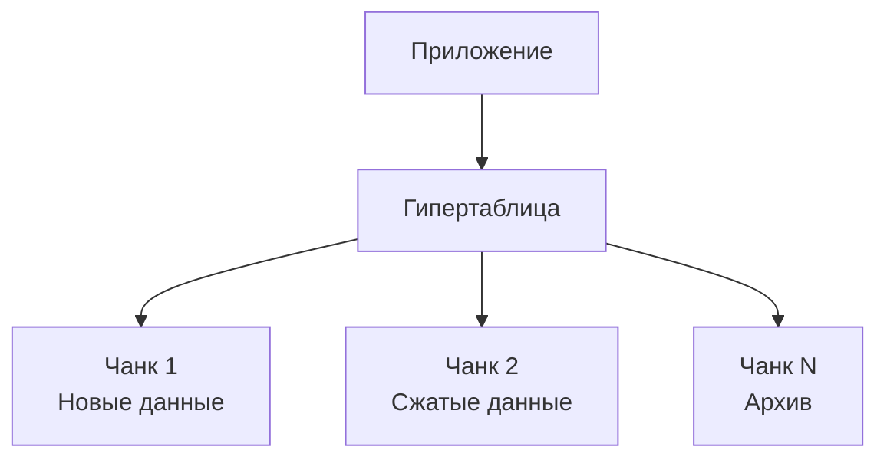

2025-10-20 в 15:52
Теги:[[Временных рядов (Time Series)]]

----
## 🎯 Что такое TimescaleDB?

**TimescaleDB** — это открытая **база данных для временных рядов (time-series data)**, построенная как расширение для PostgreSQL. Сочетает мощь реляционной СУБД со специализированной оптимизацией для временных данных.

## 🏗️ Ключевые концепции

### Гипертаблицы (Hypertables)
- **Абстракция** над автоматическим партиционированием
- **Автоматически делит** данные на чанки по времени
- **SQL-интерфейс** как у обычных таблиц
- **Масштабирование** без изменения запросов

### Чанки (Chunks)
- **Автоматические партиции** по времени
- **Управляются** автоматически
- **Оптимизированы** для быстрых временных запросов
- **Сжимаются** независимо

### Политики управления данными
- **Сжатие** - уменьшение размера старых данных
- **Удаление** - автоматическая очистка по времени
- **Ретеншн** - политики хранения данных

## 📊 Архитектурные преимущества

## 🎯 Основные сценарии использования

### ✅ Идеально для
- **Метрики и мониторинг** - системные метрики, APM
- **IoT данные** - сенсоры, телеметрия
- **Финансовые данные** - котировки, транзакции
- **Аналитика** - пользовательские события, поведение

### ⚠️ Не рекомендуется для
- **Статических данных** без временной составляющей
- **Сложных иерархических** структур
- **Данных с частыми обновлениями** записей

## 🔄 Принципы работы

### Временное партиционирование
- **Автоматическое создание** чанков по интервалам
- **Прозрачность** для приложений
- **Оптимизация** запросов по временным диапазонам

### Сжатие данных
- **Columnar-подобное** сжатие внутри чанков
- **Снижение объема** до 94%
- **Сохранение** производительности запросов

## 📈 Преимущества перед обычным PostgreSQL

| Аспект | PostgreSQL | TimescaleDB |
|--------|------------|-------------|
| **Временные запросы** | Медленно | До 20x быстрее |
| **Хранение TS-данных** | Неэффективно | Оптимизировано |
| **Автоуправление** | Ручное | Политики |
| **Масштабирование** | Сложно | Горизонтально |

---

